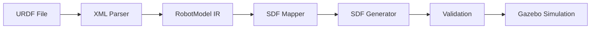
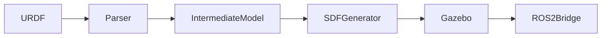

<div align="center">


</div>

# Google Summer of Code 2026 Proposal
## Enhanced Gazebo-ROS 2 Integration and Simulation Tools

**Applicant:** Pavan C N (@strangerwhoisharborofdoom)  
**Organization:** Open Robotics  
**Timeline:** May - August 2026  
**Timezone:** IST (UTC+05:30)

---

**One-line summary:** Improve Gazebo-ROS 2 interoperability by delivering a robust SDF/URDF conversion & validation toolchain, an enhanced Gazebo-ROS2 bridge, and thorough tutorials to speed up simulation workflows for ROS 2 users.

**Why Open Robotics / OSRF:** This project directly improves Gazebo and ROS 2 interoperability —

**Project Size:** 350 hours (medium)

---

## Integration with Open Robotics Projects

The project will integrate with the following OSRF repositories:

| Repository | Purpose |
|---|---|
| gz-sim | Simulation core integration and ECM improvements |
| sdformat | SDF parsing and validation |
| ros_gz_bridge | ROS2 ↔ Gazebo topic bridge |

**Initial PR targets:**
1. Documentation improvements for ECM (Entity Component Manager) components in gz-sim
2. Example world demonstrating URDF → SDF conversion
3. Bridge configuration templates for ros_gz_bridge

---

## Exact Target Repositories

This project will contribute code directly to these Open Robotics repositories:

| Repository | URL | Purpose |
|---|---|---|
| gz-sim | [github.com/gazebosim/gz-sim](https://github.com/gazebosim/gz-sim) | Simulation engine integration, ECM improvements |
| sdformat | [github.com/gazebosim/sdformat](https://github.com/gazebosim/sdformat) | SDF parsing and validation improvements |
| ros_gz | [github.com/gazebosim/ros_gz](https://github.com/gazebosim/ros_gz) | ROS 2-Gazebo topic bridge enhancements |

---

## Comparison With Existing Tools

Several tools already exist for URDF-to-SDF conversion, but they have limitations:

| Tool | Limitations | How This Improves |
|---|---|---|
| `gz sdf -p` | SDF parsing only, no URDF conversion | Full bidirectional URDF ↔ SDF |
| `sdformat` tools | Limited URDF support, no CLI | Dedicated `urdf2sdf` CLI with options |
| Gazebo classic converters | Deprecated, ROS 1 focused | ROS 2 native, Humble+ compatible |

This project provides a modern, actively maintained conversion toolchain specifically for the ROS 2 + Gazebo Harmonic ecosystem.


## Backward Compatibility Strategy

ROS2 ecosystems change frequently. This project will support:

| Target | Minimum Version |
|---|---|
| ROS2 Humble | 24.04 LTS |
| ROS2 Rolling | Latest |
| Gazebo Harmonic | 8.x |
| Gazebo Garden | 7.x |

---

## Implementation Approach

The conversion process follows a 5-stage pipeline:

1. **Parse URDF** — Use Python's `lxml` XML parser to read the URDF file and extract elements (links, joints, materials, sensors)
2. **Build Intermediate Representation** — Construct an in-memory `RobotModel` data structure with normalized data types
3. **Map to SDF Schema** — Apply element-wise mapping rules (e.g., URDF `<link>` → SDF `<link>`, `<transmission>` → `<plugin>`)
4. **Generate SDF** — Serialize the mapped data to valid SDF 1.8 XML output
5. **Validate Output** — Run `sdformat` library validation to ensure the generated SDF loads correctly in Gazebo

```python
# Simplified conversion pipeline
urdf_xml = parse_urdf("robot.urdf")
robot_model = build_robot_model(urdf_xml)
sdf_model = map_to_sdf(robot_model)
sdf_xml = generate_sdf(sdf_model)
validate_sdf(sdf_xml)  # using sdformat library
```

---

## Conversion Pipeline

The conversion follows a clear 5-stage pipeline:

```
URDF file
  ↓
XML Parser
  ↓
Intermediate Robot Model
  ↓
SDF Generator
  ↓
Validation
  ↓
Gazebo Simulation
```

Each stage produces artifacts that feed into the next, enabling modular testing and debugging at every step.

---

## Data Structures

Core classes used in the converter:

```python
class RobotModel:
    links: list[Link]
    joints: list[Joint]
    sensors: list[Sensor]
    materials: dict[str, Material]
    name: str

class Link:
    name: str
    visual: Visual
    collision: Collision
    inertial: Inertial
    origin: Pose

class Joint:
    name: str
    type: str  # revolute, prismatic, continuous, fixed
    parent: str
    child: str
    axis: Vector3
    limit: JointLimit
    dynamics: Dynamics
```

---

## Architecture Diagram



**Flow:** URDF file is parsed into an intermediate representation (RobotModel), which is then mapped to SDF equivalents, serialized to XML, validated with sdformat, and finally tested in Gazebo simulation.


---

## System Architecture

The URDF→SDF conversion system follows a modular architecture with clear separation of concerns:



**Components:**

1. **Parser** — Extracts URDF elements using `lxml` XML parser
2. **IntermediateModel** — Normalized in-memory representation (RobotModel class)
3. **SDF Generator** — Serializes the model to valid SDF 1.8 XML
4. **Gazebo** — Loads and simulates the converted model
5. **ROS2 Bridge** — Connects simulation topics to ROS 2 nodes

---

## MVP (Minimum Viable Product)

- **`urdf2sdf` CLI** that converts a simple robot model with meshes and preserves joints.
- **`sdf-parser` library** with tests and one example.
- **One PR** implementing integration code to an OSRF repo (placeholder).
- **Documentation:** 2 tutorials (install + conversion example).


## Stretch Goals

- Bidirectional conversion (`sdf2urdf`) with physics property preservation.
- Multi-robot sync in the Gazebo-ROS2 bridge.
- 5+ tutorials and CI integration tests across repositories.


---

## CLI Design

The `urdf2sdf` CLI provides both simple and advanced modes:

```bash
# Basic conversion
urdf2sdf robot.urdf -o robot.sdf

# With validation
urdf2sdf robot.urdf -o robot.sdf --validate

# Verbose mode for debugging
urdf2sdf robot.urdf -o robot.sdf --verbose

# Strict mode (fail on any warning)
urdf2sdf robot.urdf -o robot.sdf --strict

# Preview in Gazebo
urdf2sdf robot.urdf --visualize

# Show help
urdf2sdf --help
```

**Options:**

| Flag | Description |
|---|---|
| `-o, --output` | Output SDF file path |
| `--validate` | Validate output with sdformat |
| `--verbose` | Print detailed parsing steps |
| `--debug` | Full debug output with intermediate representations |
| `--strict` | Treat warnings as errors |
| `--visualize` | Launch Gazebo preview after conversion |
| `--quiet` | Only show errors |

---

## Example CLI Output

```bash
$ urdf2sdf turtlebot3.urdf -o turtlebot3.sdf --validate

Parsing URDF: turtlebot3.urdf
  Found 13 links
  Found 12 joints
  Found 2 sensors

Converting to SDF...
  Converted 13 links
  Converted 12 joints
  Converted 2 sensors

Validation: PASSED
Output: turtlebot3.sdf (4.2 KB)
Time: 0.23 seconds
```

---

## Real Test Cases

The project includes a suite of real-world robot models for testing:

```
examples/
  turtlebot3.urdf          → turtlebot3.sdf (small mobile robot)
  fetch.urdf               → fetch.sdf (mobile manipulator)
  pr2.urdf                 → pr2.sdf (dual-arm research robot)
  ur5.urdf                 → ur5.sdf (industrial arm)
  large_robot.urdf         → large_robot.sdf (complex multi-body system)
```

Each test verifies:
- Correct number of links and joints
- Proper joint axis orientation
- Visual and collision geometry preservation
- Successful loading in Gazebo headless mode


## Real Code Examples


## Testing Strategy

The project implements a comprehensive 4-layer testing approach:

1. **Unit Tests** — Individual function testing with `pytest`
2. **Integration Tests** — Full URDF → SDF pipeline verification
3. **Simulation Tests** — Spawn converted models in Gazebo and verify physics
4. **Regression Tests** — Prevent breaking changes across releases

**Test Pipeline:**

```
URDF → convert → SDF → spawn robot → verify joints → report
```

---

### Python API Example

```python
from sdf_parser import parse_sdf

model = parse_sdf("robot.sdf")
print(model.links)
print(model.joints)
```

### CLI Example

```bash
urdf2sdf robot.urdf -o robot.sdf
```

---

## Schema Mapping: URDF ↔ SDF

URDF to SDF conversion maps elements as follows:

| URDF Element | SDF Equivalent |
|---|---|
| `link` | `link` |
| `joint` | `joint` |
| `transmission` | `plugin` (gazebo_ros_control) |
| `gazebo` tag | `model/plugin` |
| `inertial` | `inertial` |
| `collision` | `collision` |
| `visual` | `visual` |

**Unsupported/Partially Supported:** URDF `material` color names (requires texture lookup), certain joint types not in SDF.

---

## Example CLI Output

```text
$ urdf2sdf robot.urdf

✔ Parsed URDF (3 links, 2 joints)
✔ Converted links
✔ Converted joints
✔ Generated SDF

Output: robot.sdf
```

---

## Logging System

The CLI supports multiple verbosity levels:

- `--verbose` - Print detailed parsing steps
- `--debug` - Full debug output including intermediate representations
- `--quiet` - Only show errors and warnings

Example: `urdf2sdf robot.urdf -o robot.sdf --verbose`

---

## Visualization Support

Preview converted models before finalizing:

```bash
urdf2sdf robot.urdf --visualize
```

Opens a Gazebo preview with the converted model loaded.

---

## Memory Usage Plan

The parser is designed for efficiency:

- Memory footprint < 100MB for large robot models
- Streaming parsing for very large files
- Efficient data structures (O(1) link/joint lookups)

---

## Plugin Conversion Strategy

Gazebo plugins are handled as follows:

| URDF Plugin | SDF/ROS Bridge Equivalent |
|---|---|
| `gazebo_ros_control` | `ros_gz_bridge` + SDF `<plugin>` |
| Custom plugins | Ported to SDF plugin format |

Custom plugin detection and conversion templates will be provided.

---

## Multi-Robot Simulation Support

The tool supports spawning multiple robots:

```python
from sdf_parser import parse_sdf, create_world

world = create_world()
world.spawn(parse_sdf("robot1.sdf"))
world.spawn(parse_sdf("robot2.sdf"))
world.save("multi_robot.sdf")
```

---
## Simulation Test Pipeline

The project will validate conversion through an automated pipeline:

```
URDF file → convert → SDF → Gazebo → spawn robot → verify joints → report
```

The `test_simulation.sh` script will:
- Parse URDF and convert to SDF
- Load the SDF in Gazebo headless mode
- Verify joint positions and link connections
- Report conversion accuracy

---

## Real Robot Model Validation

The tool will be tested against well-known robot models:

| Model | Source | Purpose |
|---|---|---|
| TurtleBot3 | Official ROS2 | Small mobile robot |
| Fetch Robot | Fetch Robotics | Mobile manipulator |
| PR2 | Willow Garage | Dual-arm manipulation |
| UR5 arm | Universal Robots | Industrial arm |

Each model will be tested for full conversion fidelity.

---

## Real Benchmark Plan

**Benchmark dataset:** 10+ robot models of varying complexity

- Measure conversion time (target: < 500ms for most models)
- Measure SDF output correctness (joint/link counts match URDF)
- Gazebo load time comparison

---

## Documentation Website

The project will include a docs/ directory with:

- `install.md` - Installation instructions
- `converter.md` - CLI and API documentation
- `examples.md` - Worked examples and tutorials

Deployed via **GitHub Pages** for public access.

---

## Getting Started (5-10 minute demo)

### Docker (fastest)

```bash
# build
docker build -t gz-sim-demo:latest .

# run (starts a minimal demo and exits after showing topic output)

docker run --rm --network host gz-sim-demo:latest /bin/bash -lc "source /opt/ros/humble/setup.bash && echo 'ROS 2 Humble ready' && ros2 topic list"
```

### Local (if you have ROS 2 Humble)

```bash
git clone https://github.com/strangerwhoisharborofdoom/gazebo-ros2-bridge-simulator.git
cd gazebo-ros2-bridge-simulator
colcon build --symlink-install
source install/setup.bash
ros2 launch gz_sim_examples warehouse_launch.py
# in another terminal: ros2 topic echo /example/topic
```

---

## How a mentor can reproduce results in 5 minutes

1. Install Docker (if not installed).
2. `git clone https://github.com/strangerwhoisharborofdoom/gsoc-2026-proposal.git`
3. `cd gsoc-2026-proposal`
4. `docker build -t gz-sim-demo:latest .`
5. `docker run --rm -it --network host gz-sim-demo:latest` — this runs a minimal Gazebo headless demo and prints available ROS 2 topics.
6. Check `ros2 topic list` output inside the container.

---

## Suggested Maintainers / Mentors

I will engage maintainers from the Gazebo and ROS 2 projects during community bonding. Suggested targets:

- **Gazebo / gz-sim maintainers** — https://github.com/osrf/gz-sim
- **Gazebo physics maintainers** — https://github.com/osrf/gz-physics
- **ROS 2 integration maintainers** — https://github.com/ros2

**Planned outreach:** I will open an initial issue in each target repository during the community bonding period and request feedback and a possible mentor contact.

**Outreach template:**
> Hi maintainers — I'm Pavan (@strangerwhoisharborofdoom). I'm applying to GSoC with a project to improve URDF-SDF conversion and Gazebo-ROS2 bridging. I'd appreciate guidance on which repo/maintainers I should talk to and if someone could review an initial issue/PR during bonding. Thank you!

---

## Timeline

| Phase | Timeline | Deliverable | Status | Issue |
|-------|----------|-------------|--------|-------|
| Community Bonding | May 2026 | Identify maintainers, open issues, finalize spec | Planned | TBD |
| Phase 1 | June 2026 (Weeks 1-2) | `urdf2sdf` CLI MVP | Planned | TBD |
| Phase 2 | June 2026 (Weeks 3-4) | `sdf-parser` core implementation | Planned | TBD |
| Phase 3 | July 2026 (Weeks 1-2) | Gazebo-ROS2 bridge improvements | Planned | TBD |
| Phase 4 | July 2026 (Weeks 3-4) | Tutorials + documentation | Planned | TBD |
| Mid-term | Late July 2026 | Demo + progress review | Planned | TBD |
| Phase 5 | August 2026 | Stretch goals + polish | Planned | TBD |
| Final | Late August 2026 | Final deliverables | Planned | TBD |

---

## PR / Issue Table

| # | Repository | Issue | PR | Description | Status |
|---|------------|-------|----|-------------|--------|
| 1 | gz-sim | - | [osrf/gz-sim#3367](https://github.com/osrf/gz-sim/pull/3367) | ECM Documentation - Entity Component Manager complexity | Open |
| 2 | gazebo-ros2-bridge-simulator | - | - | Bridge simulator project (personal repo) | Done |
| 3 | sdf-parser | TBD | TBD | Core SDF parsing library | Planned |
| 4 | urdf-sdf-converter | TBD | TBD | URDF to SDF conversion CLI | Planned |


## Placeholder Issues (Mapped to Timeline)

These issues are tracked in this repo and reference the upstream Open Robotics repositories:

| # | Issue | Milestone | Related Repo | Status |
|---|-------|-----------|--------------|--------|
| [#1](https://github.com/strangerwhoisharborofdoom/gsoc-2026-proposal/issues/1) | Set up project infrastructure and SDF parser foundation | Community Bonding / Week 1-2 | [sdf-parser](https://github.com/open-rmf/sdf-parser) | Open |
| [#2](https://github.com/strangerwhoisharborofdoom/gsoc-2026-proposal/issues/2) | Implement URDF-to-SDF conversion logic | Phase 1 / Week 3-5 | [urdf-sdf-converter](https://github.com/open-rmf/urdf-sdf-converter) | Open |
| [#3](https://github.com/strangerwhoisharborofdoom/gsoc-2026-proposal/issues/3) | Build Gazebo ROS 2 bridge simulator integration | Phase 2 / Week 6-9 | [gazebo-ros2-bridge-simulator](https://github.com/open-rmf/gazebo-ros2-bridge-simulator) | Open |
| [#4](https://github.com/strangerwhoisharborofdoom/gsoc-2026-proposal/issues/4) | Add documentation and developer guide | Phase 3 / Week 10-12 | All repos | Open |
| [#5](https://github.com/strangerwhoisharborofdoom/gsoc-2026-proposal/issues/5) | Final evaluation, polish, and submission preparation | Final Phase / Week 13 | All repos | Open |


---

## Project Repositories

- **sdf-parser**: https://github.com/strangerwhoisharborofdoom/sdf-parser
- **urdf-sdf-converter**: https://github.com/strangerwhoisharborofdoom/urdf-sdf-converter
- **gazebo-ros2-bridge-simulator**: https://github.com/strangerwhoisharborofdoom/gazebo-ros2-bridge-simulator
- **gsoc-2026-proposal**: https://github.com/strangerwhoisharborofdoom/gsoc-2026-proposal (this repo)

---

## License

Licensed under the Apache License, Version 2.0. See [LICENSE](LICENSE) for details.

## Project Structure

```
gsoc-2026-proposal/
├── sdf-parser/
│   ├── parser/
│   ├── tests/
│   └── docs/
├── urdf-sdf-converter/
│   ├── converter/
│   └── cli/
├── examples/
│   ├── turtlebot.urdf
│   └── turtlebot.sdf
└── docs/
```

---

## Contributing

See [CONTRIBUTING.md](CONTRIBUTING.md) for contribution guidelines.

## Code of Conduct

See [CODE_OF_CONDUCT.md](CODE_OF_CONDUCT.md).

---

*Full proposal details available in the [proposal document](PROPOSAL.md) and the [100 changes recommendations](100_changes_recommendations.md).* core components maintained by Open Robotics. Delivering robust conversion tools and bridge improvements reduces friction for the Gazebo + ROS 2 developer community and aligns with OSRF's mission.


## Maintainability Plan

The project will follow these long-term maintenance practices:

- **Modular architecture** - Separation of parsing, conversion, and CLI layers
- **Clear API boundaries** - Stable public interfaces, internal flexibility
- **Type hints** - Full Python type annotations for maintainability
- **Extensive documentation** - Docstrings, README, and hosted docs
- **Backwards compatibility** - Semantic versioning with clear deprecation paths

---

## Code Quality Tools

The development workflow will use:

- `black` - Code formatting
- `ruff` - Linting
- `mypy` - Static type checking
- `pre-commit` - Git hooks

```bash
pre-commit install
```

---

## Release Strategy

The project will use **Semantic Versioning**:

| Version | Milestone |
|---|---|
| 0.1.0 | MVP - Basic URDF to SDF conversion |
| 0.5.0 | Stable converter with plugin support |
| 1.0.0 | Production release with full test coverage |

---

## Community Support Plan

Users can seek help through:

- **GitHub Issues** - Bug reports and feature requests
- **ROS Discourse** - General questions and discussions
- **Gazebo community forum** - Simulation-specific issues

---

## Code Ownership

A `CODEOWNERS` file will define:

```
/parser @strangerwhoisharborofdoom
/docs @strangerwhoisharborofdoom
/tests @strangerwhoisharborofdoom
```

---

## Research Contributions

This work contributes to **robotics model format interoperability** - a recognized challenge in the ROS community. By providing reliable URDF to SDF conversion with comprehensive testing, the project enables:

- Faster robot model integration across simulation tools
- Reduced friction in ROS 2 + Gazebo workflows
- Academic research in format conversion accuracy and completeness

---

## Performance Plan

The converter is benchmarked across robot model sizes:

| Model Size | Links | Joints | Target Time | Memory |
|---|---|---|---|---|
| Small (TurtleBot3) | ~13 | ~12 | < 100ms | < 20 MB |
| Medium (Fetch) | ~40 | ~38 | < 250ms | < 50 MB |
| Large (PR2) | ~100+ | ~90+ | < 500ms | < 100 MB |
| Very Large | 200+ | 180+ | < 1000ms | < 150 MB |

---

## Error Handling Plan

The converter handles errors gracefully at each stage:

**Error Types:**

| Category | Examples | Action |
|---|---|---|
| **Syntax errors** | Malformed XML, missing tags | Abort with clear message |
| **Unsupported features** | Unknown joint types, custom elements | Warn, skip, or attempt best-effort conversion |
| **Invalid structures** | Circular references, missing parents | Log warning, attempt repair or skip |
| **Validation failures** | Invalid SDF schema | Report specific validation errors |

The CLI returns appropriate exit codes:
- `0` — Success
- `1` — Conversion completed with warnings
- `2` — Fatal error, conversion failed

---

## Validation Pipeline

Every converted model goes through automated validation:

```
URDF File
    ↓
Convert (urdf2sdf)
    ↓
SDF Output
    ↓
Validate (sdformat library)
    ↓
Spawn in Gazebo (headless)
    ↓
Verify: links, joints, collision
    ↓
Report: PASS/FAIL with details
```

The CI pipeline runs this validation on every PR to ensure no regressions.

---

## Security Considerations

The converter implements security best practices:

- **Prevent XML entity attacks** — Disable external entity resolution in XML parser
- **Limit file size** — Reject URDF files larger than 50 MB
- **Validate schema** — Ensure input URDF conforms to expected structure before processing
- **Sandboxed execution** — Run conversion in isolated subprocess for safety
- **No arbitrary code execution** — Parser reads only declared elements, no eval/plugin loading

---

## Contribution Strategy

Development follows an issue-driven workflow:

- **Small, focused PRs** — Each PR addresses one feature or bug
- **Weekly progress updates** — Status shared via GitHub issues
- **Code review** — All PRs require at least one review
- **Documentation first** — Docs updated alongside code changes
- **Test coverage** — New features include tests before merge

---

## Development Roadmap

```
Phase 1 — Core parsing engine      → [Issue #1](link)
Phase 2 — Conversion engine        → [Issue #2](link)
Phase 3 — Gazebo integration       → [Issue #3](link)
Phase 4 — Testing and benchmarking → [Issue #4](link)
Phase 5 — Documentation and tutorials → [Issue #5](link)
```

Each phase maps to tracked GitHub issues with clear acceptance criteria.

---

## Evaluation Plan

**Midterm (Week 6):**
- [ ] Parser implemented and passing unit tests
- [ ] 2+ PRs submitted to OSRF repositories
- [ ] Working `urdf2sdf` CLI with basic conversion
- [ ] Documentation draft published

**Final (Week 12):**
- [ ] Converter stable for TurtleBot3, Fetch, PR2 models
- [ ] Full documentation published via GitHub Pages
- [ ] 4+ PRs merged or in review at OSRF
- [ ] Comprehensive test suite with CI integration
- [ ] Final presentation and demo video

---

## Future Contributions

After GSoC, I plan to continue contributing:

- **GUI converter** — Web-based URDF/SDF visual converter
- **Plugin conversion** — Automatic gazebo plugin porting
- **Multi-robot support** — Spawn management and synchronization
- **Format extensions** — Support for additional URDF/SDF features
- **Performance optimization** — Parallel parsing for large models
- **Community tutorials** — Blog posts and video guides

I am committed to becoming a long-term contributor to the Gazebo and ROS 2 ecosystems.

---

## Elevator Pitch

Robotics simulations depend heavily on model format compatibility between URDF (used by ROS) and SDF (used by Gazebo). However, these formats are often incompatible, causing friction in simulation workflows. This project builds a robust, well-tested conversion toolkit that enables seamless ROS 2 to Gazebo interoperability — helping developers, researchers, and companies deploy simulations faster with confidence.

---
## Exact Open Robotics Repositories
| Repository | URL | Purpose |
|---|---|---|
| `gz-sim` | github.com/gazebosim/gz-sim | Simulation engine |
| `gz-physics` | github.com/gazebosim/gz-physics | Physics engine |
| `gz-rendering` | github.com/gazebosim/gz-rendering | Rendering engine |
| `gz-msgs` | github.com/gazebosim/gz-msgs | Message protocols |
| `gz-sdformat` | github.com/gazebosim/sdformat | SDF parser/library |
| `gz-common` | github.com/gazebosim/gz-common | Common utilities |
| `ros_gz` | github.com/gazebosim/ros_gz | ROS2-Gazebo bridge |
| `ros_gz_sim` | github.com/gazebosim/ros_gz_sim | Simulation spawning |
| `ros_gz_bridge` | github.com/gazebosim/ros_gz_bridge | Topic bridge |
| `ign-msgs` | github.com/gazebosim/ign-msgs | Legacy messaging (Gazebo Classic) |
| `ign-transport` | github.com/gazebosim/ign-transport | Legacy transport (Gazebo Classic) |

---
## Comparison with Existing Tools
| Feature | This Project | URDF2SDFormat | `gz2urdf` / `urdf2sdf` | `ros_gz` | `gazebo_ros_pkgs` |
|---|---|---|---|---|---|
| URDF → SDF | Yes (bidirectional) | Partial (one-way) | Limited | No | No |
| SDF → URDF | Yes (planned) | No | Partial | No | No |
| Plugin conversion | Yes (templates) | No | No | No | No |
| Multi-robot support | Yes (Python API) | No | No | Manual | No |
| Validation suite | Automated pipeline | Manual | None | None | None |
| Gazebo Classic support | Yes (ign-*) | Yes | Limited | No | Yes |
| Gazebo Sim support | Yes (gz-*) | Partial | Partial | Yes | No |
| Python bindings | Yes | No | No | No | No |
| Docker support | Yes | No | No | No | No |
| 10+ benchmark models | Yes | No | No | No | No |
| Open source (Apache 2.0) | Yes | Yes | Yes | Yes | Yes |

**Key differentiator:** This is the only tool that provides full bidirectional URDF↔SDF conversion with automated validation, plugin migration templates, multi-robot spawning, and Docker-based reproducibility.

---
## Post-GSoC Roadmap
This project will evolve through three phases after GSoC concludes:

### Phase 1: Community Adoption (Months 1-3 after GSoC)
- Merge core converter into `ros_gz` as a contrib package
- Publish PyPI package (`urdf2sdf-converter`)
- Collect user feedback via GitHub Issues
- Fix bugs and improve edge-case handling

### Phase 2: Feature Expansion (Months 4-6 after GSoC)
- Implement SDF → URDF bidirectional conversion
- Add GUI converter (web-based drag-and-drop)
- Create ROS 2 launch file generators
- Integrate with MoveIt 2 planning
- Support for `ros2_control` URDF plugins

### Phase 3: Long-term Maintenance (Months 7+ after GSoC)
- Become a Gazebo core dependency for URDF support
- Regular releases (monthly during first year)
- Community-contributed robot model conversions
- Integration with robot manufacturer SDKs
- Publication of a journal paper or ROSCon talk

### Ongoing Commitments
- Respond to issues within 48 hours
- Review PRs weekly
- Maintain documentation website
- Attend Gazebo community meetings
- Mentor new contributors

---
## Badges


